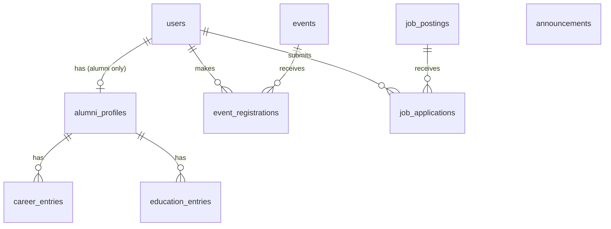
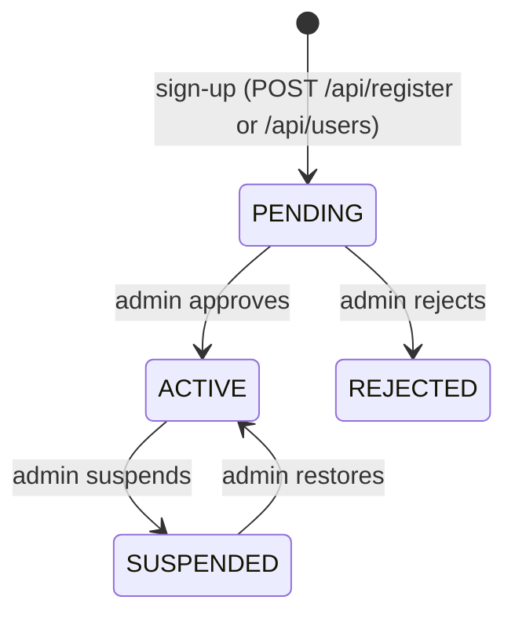

# Data Design Document (DDD)

How ATS stores its data: entities, tables, columns, constraints and the rules around them.
This is the design the Prisma schema (week 5) will implement; when the schema changes, this file changes in the same commit.

| | |
|---|---|
| **Database** | PostgreSQL 18 (Docker service `db`) |
| **Storage** | Docker volume `alumni-db-data`: kept by `docker compose down`, deleted by `docker compose down -v` |
| **Access** | Prisma 7: schema in `backend/prisma/schema.prisma`, migrations in `backend/prisma/migrations/`. The models in `backend/src/*/*.model.ts` read and write through `PrismaService` |
| **Demo data** | `backend/prisma/seed.ts` builds records with the factories in `backend/prisma/factories.ts`: synthetic Turkish names (fakerTR), e-mails at `example.com` |
| **Status** | All tables below exist in the database (first migration). Five are used by the code (`users`, `announcements`, `job_postings`, `job_applications`, and `alumni_profiles` at registration); the rest are not used yet (week still to be set) and may still change |

## 1. Conventions

| Topic | Decision |
|---|---|
| Table names | plural `snake_case` (`users`, `career_entries`) |
| Primary key | `id`, integer, generated by the database |
| Timestamps | `created_at` (and `updated_at` where a row is edited), type `timestamptz`; the API returns them as ISO strings |
| Enums | fixed lists kept in one place (section 5); a value outside the list is a `400` |
| E-mail | stored lower-case, unique |
| Foreign keys | named `<entity>_id`; what happens on delete is stated per relation |
| Personal data | only what the feature needs (see section 7) |

## 2. Entities

| Entity | Table | Purpose | Status |
|---|---|---|---|
| User | `users` | An account: who can sign in, with which role | in code (PostgreSQL) |
| Announcement | `announcements` | News posted for everyone | in code (PostgreSQL) |
| Alumni profile | `alumni_profiles` | Name, graduation year and city of a graduate | created at registration (PostgreSQL); reading and editing planned |
| Career entry | `career_entries` | One job a graduate has held | planned, week to be set |
| Education entry | `education_entries` | One degree a graduate has earned | planned, week to be set |
| Event | `events` | A meetup or talk organised by staff | planned, week to be set |
| Event registration | `event_registrations` | Which user registered for which event | planned, week to be set |
| Job posting | `job_postings` | An open position shared with graduates and students | in code (PostgreSQL) |
| Job application | `job_applications` | A user's application to a job posting | in code (PostgreSQL) |

## 3. Relationships

```mermaid
erDiagram
    users ||--o| alumni_profiles : "has (alumni only)"
    alumni_profiles ||--o{ career_entries : has
    alumni_profiles ||--o{ education_entries : has
    users ||--o{ event_registrations : makes
    events ||--o{ event_registrations : receives
    users ||--o{ job_applications : submits
    job_postings ||--o{ job_applications : receives
    announcements
```

`announcements` stands alone for now: it has no author column until accounts exist (week 11).

## 4. Tables

`PK` primary key · `FK` foreign key · `UQ` unique · `NN` not null

### 4.1 `users` *(in code)*

| Column | Type | Constraints | Notes |
|---|---|---|---|
| `id` | integer | PK | |
| `email` | varchar | UQ, NN | lower-case; duplicate → `409` |
| `role` | enum `Role` | NN | `ADMIN`, `STAFF`, `ALUMNI`, `STUDENT` |
| `status` | enum `Status` | NN, default `PENDING` | a new user always starts as `PENDING` |
| `created_at` | timestamptz | NN, default now | |

No password column yet: authentication arrives in week 11.

Rules in code today (`UsersService`):

- `POST` needs `email` and `role`; `status` is not accepted and is always set to `PENDING`.
- `PUT` needs `email`, `role` and `status`; `PATCH` needs at least one of them.
- `id` and `created_at` are read-only; any other field is a `400`.
- `email` is trimmed, lower-cased and must look like an e-mail address; `role` and `status`
  are accepted in any case (`alumni` → `ALUMNI`) and must be a value from section 5.
- Deleting a user deletes their job applications (4.9), alumni profile (4.3) and event
  registrations (4.7): the foreign keys cascade.

#### Roles

Every user has exactly one role. The role says what kind of person the account belongs to and,
from week 11, what the account may do.

| Role | Who | In code today | Planned (week 11 and later) |
|---|---|---|---|
| `ADMIN` | IT or alumni-office administrator | stored only | approves or rejects sign-ups, suspends accounts, manages roles |
| `STAFF` | university staff (career centre, alumni office) | stored; cannot apply to job postings | posts announcements, job postings and events; reads aggregate reports |
| `ALUMNI` | a graduate | may apply to job postings | keeps an alumni profile with career and education history (4.3–4.5), chooses who sees what, offers mentorship, registers for events |
| `STUDENT` | a current student | may apply to job postings | searches the alumni directory, requests mentorship, registers for events |

A visitor without an account is not a role and has no row in `users`; they will see only
aggregate figures.

Role rules:

| Rule | Where |
|---|---|
| Only `ALUMNI` and `STUDENT` may apply to a job posting; other roles → `400` | `JobApplicationsService` (4.9) |
| Only `STUDENT`, `ALUMNI` and `STAFF` may self-register; `ADMIN` → `400` | `RegistrationService` (4.10) |
| Only an `ALUMNI` user has an alumni profile (at most one) | `RegistrationService` (4.10) and the `UQ` on `user_id` (4.3) |
| Only `ADMIN` may change a user's `role` or `status` | planned, week 11; today any client can |
| Only `STAFF` and `ADMIN` may create announcements, job postings and events | planned, week 11; today any client can |

#### Account status

`status` says whether the account may be used. A new account always starts as `PENDING`.

```mermaid
stateDiagram-v2
    [*] --> PENDING : sign-up (POST /api/register or /api/users)
    PENDING --> ACTIVE : admin approves
    PENDING --> REJECTED : admin rejects
    ACTIVE --> SUSPENDED : admin suspends
    SUSPENDED --> ACTIVE : admin restores
```

| Status | Meaning |
|---|---|
| `PENDING` | signed up, waiting for an admin |
| `ACTIVE` | approved; can sign in and use the features of their role |
| `REJECTED` | the sign-up was refused |
| `SUSPENDED` | an approved account that is blocked for now |

Today the diagram is not enforced: `PUT` and `PATCH` accept any status value, and the status
does not yet limit what a user can do (a `PENDING` student can still apply to a job posting).
The transitions and the "only `ACTIVE` users act" rule arrive with sign-in in week 11.

### 4.2 `announcements` *(in code)*

| Column | Type | Constraints | Notes |
|---|---|---|---|
| `id` | integer | PK | |
| `title` | varchar(120) | NN | trimmed, 1–120 characters |
| `content` | varchar(2000) | NN | trimmed, 1–2000 characters |
| `created_at` | timestamptz | NN, default now | |
| `updated_at` | timestamptz | NN | set on every edit |

The list is shown newest first.

### 4.3 `alumni_profiles` *(created at registration)*

| Column | Type | Constraints | Notes |
|---|---|---|---|
| `id` | integer | PK | |
| `user_id` | integer | FK → `users.id`, UQ, NN | one profile per user; delete the user → delete the profile |
| `full_name` | varchar | NN | trimmed, inner spaces collapsed, 2–100 characters |
| `graduation_year` | integer | NN | whole number from 1950 to the current year |
| `city` | varchar | | optional, at most 60 characters; city level only, no street address |

Registration (4.10) creates the profile together with an `ALUMNI` user, in one transaction.
Reading and editing profiles is planned, week to be set.

### 4.4 `career_entries` *(planned)*

| Column | Type | Constraints | Notes |
|---|---|---|---|
| `id` | integer | PK | |
| `alumni_profile_id` | integer | FK → `alumni_profiles.id`, NN | delete the profile → delete its entries |
| `company` | varchar | NN | |
| `position` | varchar | NN | |
| `start_date` | date | NN | |
| `end_date` | date | | empty = current job; must not be before `start_date` |

### 4.5 `education_entries` *(planned)*

| Column | Type | Constraints | Notes |
|---|---|---|---|
| `id` | integer | PK | |
| `alumni_profile_id` | integer | FK → `alumni_profiles.id`, NN | delete the profile → delete its entries |
| `institution` | varchar | NN | |
| `degree` | varchar | NN | |
| `graduation_year` | integer | NN | |

### 4.6 `events` *(planned)*

| Column | Type | Constraints | Notes |
|---|---|---|---|
| `id` | integer | PK | |
| `title` | varchar | NN | |
| `description` | text | | |
| `starts_at` | timestamptz | NN | |
| `location` | varchar | | |
| `capacity` | integer | | empty = no limit |

### 4.7 `event_registrations` *(planned)*

| Column | Type | Constraints | Notes |
|---|---|---|---|
| `id` | integer | PK | |
| `event_id` | integer | FK → `events.id`, NN | delete the event → delete its registrations |
| `user_id` | integer | FK → `users.id`, NN | delete the user → delete their registrations |
| `created_at` | timestamptz | NN, default now | |
| | | UQ (`event_id`, `user_id`) | a user registers once per event; duplicate → `409` |

### 4.8 `job_postings` *(in code)*

| Column | Type | Constraints | Notes |
|---|---|---|---|
| `id` | integer | PK | |
| `title` | varchar(120) | NN | required; trimmed, 1–120 characters |
| `company` | varchar | NN | required; trimmed, not empty |
| `location` | varchar | | the city (optional); city level only; empty = not stated |
| `work_type` | enum `WorkType` | NN | `ONSITE`, `HYBRID`, `REMOTE` |
| `employment_type` | enum `EmploymentType` | NN | `FULL_TIME`, `PART_TIME`, `INTERNSHIP`, `CONTRACT` |
| `description` | text | | optional; empty = not stated |
| `apply_url` | varchar | | link or `mailto:`; empty = apply in ATS (`job_applications`) |
| `deadline` | date | | empty = open until removed |
| `created_at` | timestamptz | NN, default now | |
| `updated_at` | timestamptz | NN | set on every edit |

Rules: `title` and `company` are required, and `title` is at most 120 characters. The city
(`location`) and `description` are optional; a missing or empty value is stored as empty (`null`).

The list is shown newest first. A posting belongs to no user: users are linked to postings
only through their applications (4.9).

### 4.9 `job_applications` *(in code)*

| Column | Type | Constraints | Notes |
|---|---|---|---|
| `id` | integer | PK | |
| `job_posting_id` | integer | FK → `job_postings.id`, NN | delete the posting → delete its applications |
| `applicant_id` | integer | FK → `users.id`, NN | delete the user → delete their applications |
| `cover_letter` | text | | trimmed, at most 2000 characters; empty = none |
| `status` | enum `ApplicationStatus` | NN, default `SUBMITTED` | a new application always starts as `SUBMITTED` |
| `created_at` | timestamptz | NN, default now | |
| `updated_at` | timestamptz | NN | set on every edit |
| | | UQ (`job_posting_id`, `applicant_id`) | a user applies once per posting; duplicate → `409` |

The list is shown newest first. Only `ALUMNI` and `STUDENT` may apply, and not after the
posting's `deadline`.

### 4.10 Registration *(in code, no table of its own)*

`POST /api/register` is the route of the sign-up page (`/register`). It writes to `users` and,
for a graduate, to `alumni_profiles`. Rules (`RegistrationService`):

| Field | Rule |
|---|---|
| `email` | required; same rules as 4.1; already used → `409` |
| `role` | required; `STUDENT`, `ALUMNI` or `STAFF`. `ADMIN` cannot self-register → `400` |
| `acceptPrivacy` | must be `true` (the privacy notice is accepted); not stored |
| `fullName`, `graduationYear`, `city` | for `ALUMNI` only, see 4.3 (`city` optional); sent with another role → `400` |

The new account is always `PENDING`. Any other field is a `400`. If two requests send the same
e-mail at the same moment, the `UNIQUE` constraint stops the second one, which gets `409`.
No password yet: sign-in arrives in week 11.

## 5. Enums

| Enum | Values |
|---|---|
| `Role` | `ADMIN`, `STAFF`, `ALUMNI`, `STUDENT` |
| `Status` | `PENDING`, `ACTIVE`, `REJECTED`, `SUSPENDED` |
| `WorkType` | `ONSITE`, `HYBRID`, `REMOTE` |
| `EmploymentType` | `FULL_TIME`, `PART_TIME`, `INTERNSHIP`, `CONTRACT` |
| `ApplicationStatus` | `SUBMITTED`, `REVIEWED`, `ACCEPTED`, `REJECTED` |

## 6. Where each rule lives

| Rule | Enforced by |
|---|---|
| Required fields, length limits, enum values | service (`400`) |
| Missing record | service (`404`), the model only returns `undefined` or `false` |
| Duplicate e-mail / registration / application | service checks first (`409`); a database `UNIQUE` constraint is the safety net |
| Row references that must exist | database foreign keys |

## 7. Privacy (KVKK)

Not stored, by design: national ID number, birth date, grades, home address.
Location is city level. Demo and seed data are synthetic.

## 8. Open points

- Whether an alumnus can hold more than one profile or a user can hold two roles (now: one role, one profile). Proposed: a student who graduates keeps the same account and changes role from `STUDENT` to `ALUMNI`.
- Which profile fields get per-field visibility (README section 7) and how that is stored: planned for week 11, not designed yet.
